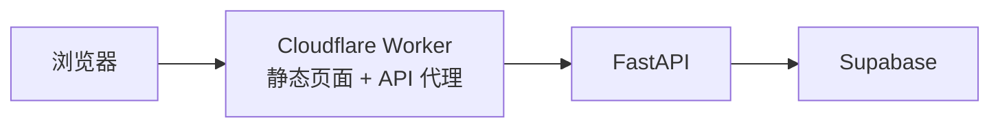

# Tags

一个轻量的全栈标签记录应用：用户注册、登录后，可以按账号独立保存和查看自己的文字标签。

在线地址：<https://tags.newkis.cc>

## 项目概览

Tags 用一个小而完整的业务场景串起前端、后端、数据库与部署流程。

- **账号系统**：邮箱注册与登录，密码使用 PBKDF2 + 随机盐哈希存储
- **数据隔离**：每次标签查询、创建和删除都绑定当前登录邮箱
- **标签管理**：支持新增、列表、正文搜索、按标签筛选、删除与统计
- **前端页面**：原生 HTML、CSS、JavaScript，实现注册、登录、退出和标签展示
- **部署入口**：Cloudflare Worker 托管静态页面，并将 `/api/*` 请求转发给后端

## 系统结构



当前线上请求链路：

1. 浏览器访问 `tags.newkis.cc`，Worker 返回 `frontend/` 中的静态文件。
2. 前端统一请求相对路径 `/api/*`。
3. Worker 将请求转发到 `API_ORIGIN/tags-api/*`。
4. FastAPI 完成身份校验和业务处理，数据写入 Supabase。

## 技术栈

| 部分 | 技术 |
| --- | --- |
| 前端 | HTML、CSS、JavaScript |
| 后端 | Python、FastAPI、Uvicorn |
| 数据库 | Supabase |
| 边缘部署 | Cloudflare Workers |
| 身份校验 | Bearer Token、PBKDF2-HMAC-SHA256 |

## 目录结构

```text
tag-service/
├── frontend/
│   ├── index.html       # 登录、注册和标签页面
│   ├── app.js           # 前端交互与 API 请求
│   └── style.css        # 页面样式
├── main.py              # FastAPI 接口、认证与业务逻辑
├── run.py               # 本地启动入口
├── worker.js            # 静态资源服务与 API 反向代理
├── wrangler.jsonc       # Cloudflare Worker 配置
├── tag_mcp.py           # 早期 MCP 接入实验
├── requirements.txt
└── .env.example
```

## 本地运行后端

### 1. 获取项目并安装依赖

需要 Python 3.9 或更高版本。

```bash
git clone https://github.com/7k777/tag-service.git
cd tag-service

python -m venv .venv
source .venv/bin/activate
pip install -r requirements.txt
```

Windows PowerShell 激活虚拟环境：

```powershell
.venv\Scripts\Activate.ps1
```

### 2. 配置 Supabase

复制环境变量示例：

```bash
cp .env.example .env
```

在 `.env` 中填写：

```env
SUPABASE_URL=https://your-project.supabase.co
SUPABASE_KEY=your-supabase-key
```

然后在 Supabase SQL Editor 中创建表：

```sql
create table if not exists public.users (
  id bigint generated by default as identity primary key,
  email text not null unique,
  password_hash text not null
);

create table if not exists public.tags (
  id bigint generated by default as identity primary key,
  content text not null,
  tags text[] not null default '{}'::text[],
  user_email text not null,
  mood text,
  created_at timestamptz not null default now()
);

create index if not exists tags_user_email_created_at_idx
  on public.tags (user_email, created_at desc);
```

> `SUPABASE_KEY` 只应保存在后端环境中，不要写进前端代码或提交到仓库。请根据使用的 key 配置合适的 Supabase 权限与 RLS 策略。

### 3. 启动服务

```bash
python run.py
```

后端默认运行在 <http://127.0.0.1:18111>，接口文档位于 <http://127.0.0.1:18111/docs>。

## API 使用流程

除注册、登录和健康检查外，标签接口都需要请求头：

```http
Authorization: Bearer <token>
```

### 1. 注册

```bash
curl -X POST http://127.0.0.1:18111/register \
  -H "Content-Type: application/json" \
  -d '{"email":"demo@example.com","password":"your-password"}'
```

### 2. 登录并取得 Token

```bash
curl -X POST http://127.0.0.1:18111/login \
  -H "Content-Type: application/json" \
  -d '{"email":"demo@example.com","password":"your-password"}'
```

响应示例：

```json
{
  "token": "<token>",
  "email": "demo@example.com"
}
```

### 3. 新增标签

```bash
curl -X POST http://127.0.0.1:18111/tags \
  -H "Content-Type: application/json" \
  -H "Authorization: Bearer <token>" \
  -d '{
    "content": "完成 Tags 项目的 README",
    "tags": ["项目", "文档"],
    "mood": "开心"
  }'
```

### 4. 查询标签

```bash
# 最新标签，limit 范围为 1～100
curl "http://127.0.0.1:18111/tags?limit=20" \
  -H "Authorization: Bearer <token>"

# 按正文关键词搜索
curl "http://127.0.0.1:18111/tags/search?q=README" \
  -H "Authorization: Bearer <token>"

# 按标签名筛选
curl "http://127.0.0.1:18111/tags/by-tag?tag=项目" \
  -H "Authorization: Bearer <token>"

# 查看标签总数与高频标签
curl "http://127.0.0.1:18111/tags/stats" \
  -H "Authorization: Bearer <token>"
```

### 5. 删除标签

```bash
curl -X DELETE http://127.0.0.1:18111/tags/<id> \
  -H "Authorization: Bearer <token>"
```

## 接口一览

| 方法 | 路径 | 是否登录 | 作用 |
| --- | --- | --- | --- |
| `GET` | `/` | 否 | 服务状态信息 |
| `GET` | `/health` | 否 | 健康检查 |
| `POST` | `/register` | 否 | 注册账号 |
| `POST` | `/login` | 否 | 登录并获取 Token |
| `GET` | `/tags` | 是 | 获取当前账号的标签 |
| `POST` | `/tags` | 是 | 新增标签 |
| `GET` | `/tags/search` | 是 | 按正文搜索 |
| `GET` | `/tags/by-tag` | 是 | 按标签名筛选 |
| `GET` | `/tags/stats` | 是 | 获取标签统计 |
| `DELETE` | `/tags/{id}` | 是 | 删除当前账号的标签 |

## 部署说明

`frontend/app.js` 使用相对地址 `/api`，线上由 `worker.js` 负责转发。部署到自己的 Cloudflare 账号前，需要修改：

- `worker.js` 中的 `API_ORIGIN`，指向自己的后端域名
- `wrangler.jsonc` 中的 Worker 名称和自定义域名

使用 Wrangler 部署：

```bash
npx wrangler deploy
```

如果只在本地打开前端，需要额外配置一个将 `/api` 转发到 `http://127.0.0.1:18111` 的开发代理；直接双击 `index.html` 无法完成这一步。

## 当前限制

这是一个正在迭代的学习型项目，目前还有这些限制：

- 登录 Token 保存在后端内存中，服务重启后需要重新登录
- 暂未提供退出 Token 失效、刷新 Token、邮箱验证和找回密码
- CORS 当前允许全部来源，生产环境应限制为实际前端域名
- 按标签筛选和统计会先读取当前账号的数据再由应用层处理，适合当前的小数据量
- `tag_mcp.py` 是早期实验代码，尚未适配现在的登录鉴权流程

## 后续计划

- 使用持久化会话或 JWT 完善认证
- 增加标签编辑、分页和多标签输入
- 将筛选与统计下沉到数据库查询
- 补充自动化测试和持续集成
- 完成 MCP 接口与现有账号系统的适配

## License

本仓库采用分区授权：除 `frontend/` 外的原创源码使用 **Mozilla Public License 2.0 (MPL-2.0)**；`frontend/`（包括 HTML、CSS、JavaScript、视觉设计与布局等）由 **7k777 保留全部权利**，公开仅供查看，未经许可不得修改、复制、再分发或制作衍生版本。详见 [LICENSE](LICENSE)、[MPL-2.0](LICENSES/MPL-2.0.txt) 与 [frontend/LICENSE](frontend/LICENSE)。
